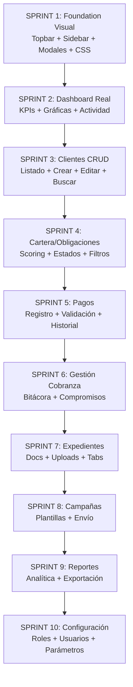

# Plan Maestro: Servillantas El Puente — De Esqueleto a Plataforma Real

## Diagnóstico Topográfico (Estado Actual)

### ✅ Infraestructura RESUELTA
| Componente | Estado | Evidencia |
|---|---|---|
| Deploy FTP → cPanel | ✅ Funcional | Raíz FTP = `public_html/` |
| GitHub sync | ✅ Sincronizado | `newvitec360-tesla/servillantas` |
| PHP 8.4 ejecutando | ✅ Confirmado | `index.php` responde HTTP 200 |
| Base de datos MySQL | ✅ Conectada | `servilla_admin` con 15 tablas creadas |
| Login/Auth/CSRF | ✅ Funcional | Admin puede autenticarse |
| CSP Nonce-only | ✅ Activo | Headers confirmados |
| Middleware pipeline | ✅ Funcional | SecurityHeaders → Auth → CSRF |

### 🏗️ Lo Que EXISTE (Esqueleto)

| Capa | Qué tiene | Qué le falta |
|---|---|---|
| **Controllers (9)** | Stub `index()` que solo renderea vista placeholder | CRUD completo: `show()`, `create()`, `store()`, `update()`, `delete()` |
| **Services (4)** | Solo `DashboardService` tiene lógica real | Servicios de negocio para cada módulo |
| **Repositories (1)** | Solo `UsuarioRepository` | Repos para Clientes, Obligaciones, Pagos, Gestiones, Expedientes |
| **Views (8 módulos)** | Placeholders con tablas fake estáticas | Vistas con datos reales, formularios, modales, filtros |
| **CSS** | Design system base sólido (33 líneas) | Más componentes: modales, formularios, charts, pills avanzadas |
| **JS** | Archivo vacío `app.js` | Interactividad: modales, filtros, AJAX CRUD, toasts |
| **Mockup referencia** | HTML completo de 2,454 líneas con 9 páginas | Es el NORTE visual — cada módulo debe verse así |

### 🎯 Gap Visual: Mockup vs MVC Actual

El mockup (`demo_mockup_servillantas_el_puente_pro.html`) tiene un nivel de fidelidad **premium** que el MVC actual NO alcanza. Diferencias clave:

| Elemento | Mockup Pro | MVC Actual |
|---|---|---|
| **KPI Cards** | Con íconos, gradientes, comparación mes anterior | Solo número plano |
| **Topbar** | Búsqueda global, notificaciones, avatar usuario | Solo nombre + botón salir |
| **Tablas** | Sorteable, pills de color, acciones por fila | Tabla estática sin datos |
| **Sidebar** | Íconos Unicode, badge de sección | Solo texto con ▣ genérico |
| **Modales** | Formularios completos con validación visual | No existen |
| **Toasts** | Notificaciones flotantes animadas | No existen |
| **Gráficas** | Donut CSS, barras apiladas, líneas SVG | No existen |
| **Formularios** | Inputs estilizados con focus ring rojo | No existen |

---

## Estrategia de Construcción

> [!IMPORTANT]
> Cada módulo se construye en un ciclo completo: **Controller → Service → Repository → Views → JS → Deploy → Verificar → Aprobar**.
> No se avanza al siguiente módulo hasta que el anterior esté en producción y aprobado.

### Orden de Prioridad (basado en valor de negocio)



---

## Propuesta Detallada por Sprint

### SPRINT 1 — Foundation Visual (Fidelidad del Mockup)
**Objetivo**: Que TODAS las páginas se vean premium antes de programar lógica.

#### [MODIFY] [app.css](file:///C:/Users/Newvitec-VR/.gemini/antigravity/scratch/14-Servillantas-Tesla/servillantas_mvc/public/assets/desktop/css/app.css)
- Migrar las 1,024 líneas de CSS del mockup pro al design system
- Agregar: `.metric`, `.metric-icon`, `.pill`, `.btn`, `.field`, `.modal`, `.toast`, `.donut`, `.chart-panel`, `.funnel`
- Agregar: topbar completo con search, notificaciones, avatar
- Agregar: animaciones `fadeIn`, `toastIn`, `modalIn`

#### [MODIFY] [_header.php](file:///C:/Users/Newvitec-VR/.gemini/antigravity/scratch/14-Servillantas-Tesla/servillantas_mvc/app/Views/desktop/partials/_header.php)
- Topbar premium: búsqueda global, campana de notificaciones con badge, avatar con iniciales y rol

#### [MODIFY] [_sidebar.php](file:///C:/Users/Newvitec-VR/.gemini/antigravity/scratch/14-Servillantas-Tesla/servillantas_mvc/app/Views/desktop/partials/_sidebar.php)
- Íconos Unicode diferenciados por módulo (◫ ⟁ ☷ ✉ ◪ ◧ ⚙)
- Nota inferior actualizada

#### [NEW] app/Views/desktop/partials/_modals.php
- Sistema de modales reutilizable (crear cliente, registrar pago, acción rápida, exportar)

#### [NEW] app/Views/desktop/partials/_toasts.php
- Sistema de notificaciones toast flotantes

#### [MODIFY] [app.js](file:///C:/Users/Newvitec-VR/.gemini/antigravity/scratch/14-Servillantas-Tesla/servillantas_mvc/public/assets/desktop/js/app.js)
- Módulo IIFE para modales, toasts, sorteo de tablas, búsqueda global
- Todo con `addEventListener`, CSRF token en FormData, nonce compliance

---

### SPRINT 2 — Dashboard Real con KPIs

#### [MODIFY] [DashboardController.php](file:///C:/Users/Newvitec-VR/.gemini/antigravity/scratch/14-Servillantas-Tesla/servillantas_mvc/app/Controllers/Desktop/DashboardController.php)
- Pasar más KPIs: efectividad, promesas por vencer, pagos por validar, actividad reciente

#### [MODIFY] [DashboardService.php](file:///C:/Users/Newvitec-VR/.gemini/antigravity/scratch/14-Servillantas-Tesla/servillantas_mvc/app/Services/DashboardService.php)
- Queries para: actividad reciente (últimas gestiones), segmentos rápidos, trend vs mes anterior

#### [MODIFY] [dashboard/index.php](file:///C:/Users/Newvitec-VR/.gemini/antigravity/scratch/14-Servillantas-Tesla/servillantas_mvc/app/Views/desktop/dashboard/index.php)
- KPI cards con `.metric` + `.metric-icon` + comparación mes anterior
- Tabla de clientes prioritarios con pills de riesgo
- Panel de actividad reciente
- Panel de segmentos rápidos

---

### SPRINT 3 — Clientes CRUD Completo

#### [NEW] app/Repositories/ClienteRepository.php
- `findAll()` con filtros (búsqueda, estado, paginación)
- `findById()`, `insert()`, `update()`, `delete()`
- `search()` por nombre, documento, NIT, placa

#### [NEW] app/Services/ClienteService.php
- Validación de negocio, búsqueda avanzada, paginación

#### [MODIFY] ClientesController.php
- `index()`: listado con filtros y paginación
- `show($id)`: ficha individual con obligaciones, teléfonos, correos
- `create()` / `store()`: formulario + persistencia
- `update($id)`: edición
- `delete($id)`: eliminación con confirmación

#### [MODIFY] clientes/index.php
- Tabla real con datos de BD, pills de estado, acciones por fila
- Barra de filtros (búsqueda, estado localización)
- Botones: Crear cliente, Importar Excel, Exportar

#### [NEW] clientes/show.php, clientes/create.php
- Ficha individual del cliente (tabs: datos, obligaciones, gestiones, documentos)
- Formulario de creación/edición

---

### SPRINT 4 — Cartera / Obligaciones

#### [NEW] app/Repositories/ObligacionRepository.php
#### [NEW] app/Services/CarteraService.php
#### [MODIFY] CarteraController.php
- CRUD de obligaciones vinculadas a clientes
- Filtros por nivel de riesgo (S1/S2/S3), estado, antigüedad

#### [MODIFY] cartera/index.php
- Vista con donut de distribución por riesgo
- Tabla con sorting, pills de estado, días mora
- Barras apiladas de cartera por segmento

---

### SPRINT 5 — Pagos

#### [NEW] app/Repositories/PagoRepository.php
#### [NEW] app/Services/PagoService.php
#### [MODIFY] PagosController.php
- Registro de pagos manuales, validación, historial

#### [MODIFY] pagos/index.php
- Tabla de pagos con estado de validación
- Modal de registro rápido de pago
- KPIs de recaudo

---

### SPRINT 6-10 — (Gestiones, Expedientes, Campañas, Reportes, Config)
Misma estructura VADR para cada módulo.

---

## Reglas Inquebrantables de Fidelidad Visual

> [!CAUTION]
> El mockup `demo_mockup_servillantas_el_puente_pro.html` es el NORTE visual. Si algo se ve diferente → es un bug visual que se corrige antes de avanzar.

1. **CSS del mockup es la biblia** — Toda clase CSS se migra 1:1
2. **Colores**: `--red:#e30713`, `--black:#111318`, `--bg:#f4f5f8` — NO inventar colores
3. **Border radius**: Cards `22px`, controles `14px`, pills `999px`
4. **Tipografía**: Inter vía Google Fonts — NO system-ui solo
5. **Sombras**: `0 14px 34px rgba(15,19,24,.06)` — NO box-shadow genéricos
6. **Animaciones**: `fadeIn .22s ease`, hover `translateY(-1px)` — micro-interacciones obligatorias
7. **Pills de estado**: `.pill.red`, `.pill.amber`, `.pill.green` con fondos suaves
8. **Métricas**: Con `.metric-icon` (54×54px, coloreado) — NO texto plano

## Verificación

### Después de cada Sprint
1. `git add . && git commit -m "feat(módulo): descripción" && git push origin main`
2. FTP deploy a raíz del servidor (sin prefijo `public_html/`)
3. Verificar en `https://servillantaselpuente.com` que se ve correcto
4. Captura de pantalla comparativa vs mockup
5. Aprobación del usuario

### Checklist de Deploy
```
✅ Archivos subidos a raíz FTP (NO a public_html/)
✅ Assets en /public/assets/ accesibles
✅ CSP nonce en todos los <script>
✅ CSRF token en todos los forms POST
✅ No hay /desktop/index.php en ningún href — todo va a /index.php?r=
✅ .env NO se sube a GitHub
```

## Open Questions

> [!IMPORTANT]
> **¿Quieres que arranque directamente con el Sprint 1 (Foundation Visual)?** Esto haría que TODAS las páginas existentes se vean premium inmediatamente, incluso antes de tener datos reales. Es la base para todo lo demás.

> [!NOTE]
> **¿Hay algún módulo que sea más urgente que otro?** El roadmap prioriza Dashboard → Clientes → Cartera → Pagos, pero si el negocio necesita otra secuencia, lo ajustamos.

> [!NOTE]
> **¿Necesitas Google Fonts (Inter) cargado desde CDN?** El mockup lo usa pero el MVC actual no lo tiene en el `<head>`. Lo agregaré en Sprint 1.
